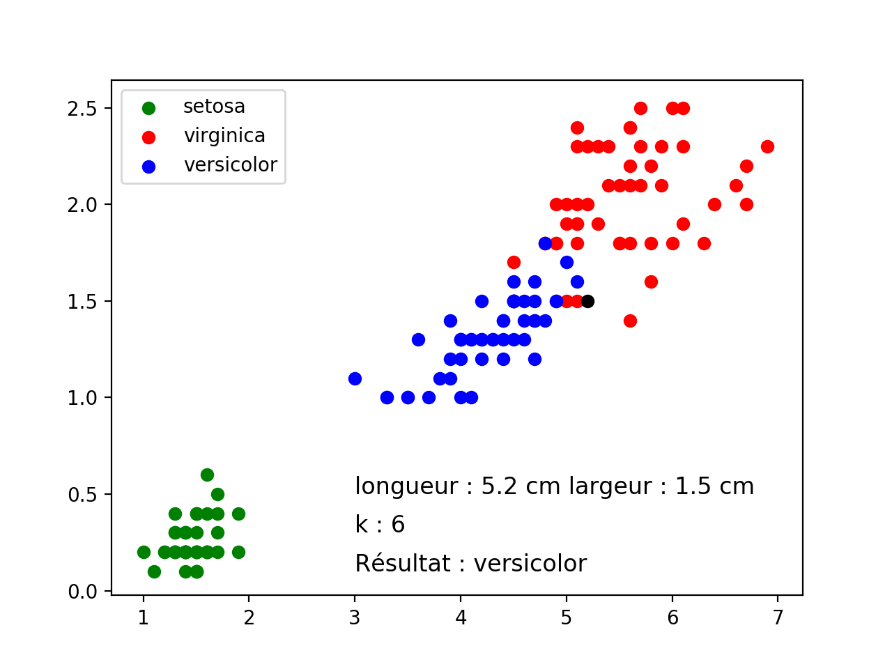

# Les iris : un exemple de l'algorithme des k plus proches voisins


## 1. Introduction

L’algorithme des k plus proches voisins appartient à la famille des **algorithmes d’apprentissage automatique** ou machine learning. L’idée d’apprentissage automatique ne date pas d’hier, puisque le terme de machine learning a été utilisé pour la première fois par l’informaticien américain Arthur Samuel en 1959. Les algorithmes d’apprentissage automatique ont connu un fort regain d’intérêt au début des années 2000 notamment grâce à la quantité de données disponibles sur internet. L’algorithme des k plus proches voisins est un algorithme d’apprentissage supervisé, il est nécessaire d’avoir des données labellisées. À partir d’un ensemble E de données labellisées, il sera possible de classer, c'est-à-dire de déterminer le label d’une nouvelle donnée (pour une donnée n’appartenant pas à E). À noter qu’il est aussi possible d’utiliser l’algorithme des k plus proches voisins à des fins de régression (on cherche dans ce cas à déterminer une valeur numérique à la place d’une classe), mais cet aspect des choses ne sera pas abordé ici. 
Cette première approche des algorithmes d’apprentissage peut aussi nous amener à réfléchir sur l’utilisation de nos données personnelles : de nombreuses sociétés utilisent les données concernant leurs utilisateurs afin de nourrir des algorithmes de machine learning qui permettront à ces sociétés d’en savoir toujours plus sur nous et ainsi de mieux cerné nos "besoins" en termes de consommation.

## 2. Principe de l'algorithme

L’algorithme de k plus proches voisins ne nécessite pas de phase d’apprentissage à proprement parler, il faut juste stocker le jeu de données d’apprentissage. Soit un ensemble E contenant n données labellisées : E={(yi, xi)} avec i compris entre 1 et n, où yi correspond à la classe (le label) de la donnée i et où le vecteur xi de dimension p (xi=(x1i, x2i, ..., xpi)) représente les variables prédictrices de la donnée i.  
Soit une donnée u qui n’appartient pas à E et qui ne possède pas de label (u est uniquement caractérisée par un vecteur x de dimension p). Soit d une fonction qui renvoie la distance entre la donnée i et une donnée quelconque appartenant à E.
Soit k un entier inférieur ou égal à n. 

<b>
Voici le principe de l’algorithme de k plus proches voisins :  
1) On calcule les distances entre la donnée u et chaque donnée appartenant à E à l’aide de la fonction d de calcul de distance.   
2) On retient les k données du jeu de données E les plus proches de u.    
3) On attribue à u la classe qui est la plus fréquente parmi les k données les plus proches.  </b>

## 3. Étude d'un exemple en botanique : les iris

### 3.1. Les données

Nous avons choisi ici de nous baser sur le jeu de données ”iris de Fisher” dont les trois espèces sont représentées ci-dessous :

*Iris_virginica*   
  
*Iris_versicolor*  
  
*Iris_setosa*   


Ce jeu de données est composé de 50 entrées, pour chaque entrée nous avons :   

▷ la longueur des sépales (en cm)  
▷ la largeur des sépales (en cm)  
▷ la longueur des pétales (en cm)  
▷ la largeur des pétales (en cm)  
▷ l’espèce d’iris : Iris setosa, Iris virginica ou Iris versicolor (label)

Dans un souci de simplification, nous avons choisi de travailler uniquement sur la longueur des pétales.
Par ailleurs, nous encoderons les espèces avec des chiffres : '0' pour Iris setosa, '1' pour Iris virginica et '2' pour Iris versicolor.

Voici les premières lignes du fichier csv utilisé.

```python
longueur;largeur;espece
1.4;0.2;0
1.4;0.2;0
1.3;0.2;0
1.5;0.2;0
1.4;0.2;0
1.7;0.4;0
1.4;0.3;0
1.5;0.2;0
1.4;0.2;0
1.5;0.1;0
1.5;0.2;0
1.6;0.2;0
```
### 3.2. Utilisation de la bibliothèque matplotlib

Nous utiliserons la bibliothèque matplotlib pour visualiser les données.
Une fois téléchargée la bibliothèque [matplotlib](https://matplotlib.org/users/installing.html), on importera le module `pyplot`.

### 3.3. Code à compléter

Les fonctions à compléter sont : `create` ; `distance` ; `caractere_le_plus_commun` ; `proches_voisins` ; `space` ; `amount`.

<u>On lira avec soin les docstring de toutes les fonctions qui sont là pour vous aider et vous permettre de tester votre code par vous-mêmes.</u>

N.B : la lecture d'un tableau csv a déjà été vue ici : [traitement de données en table](https://github.com/VLesieux/NSI/blob/master/Cours_4_Traitement_donn%C3%A9es_tables/traitement_des_donnees.md)

```python
import matplotlib.pyplot as plt#importe le module pour la représentation des graphes

longueur=float(input("longueur du pétale : "))
largeur=float(input("largeur du pétale : "))
k=int(input("valeur de k : "))

def create (x, y, s):#crée un dictionnaire à partir d'un triplet
    """
    Renvoie un dictionnaire à partir d'un triplet
    :param x : float désigne la longueur du pétale
    :param y : float désigne la largeur du pétale
    :param s : str '0','1' ou '2' en fonction de l'espèce de l'iris
    :return: dict
    :Exemple:
    >>> create(1.5,2.4,'1')
    {'x': 1.5, 'y': 2.4, 's': '1'}
    """
    pass

def lecture_tableau(text):
    f=open(text,"r")
    champs=f.readline()# on lit la première ligne des entêtes
    lignes=f.readlines()# on lit ensuite les autres lignes
    donnees = dict([])#initialise un dictionnaire
    numero=0
    for ligne in lignes:#lecture du fichier
        donnees[numero]=create(ligne.rstrip('\n').split(";")[0], ligne.rstrip('\n').split(";")[1], ligne.rstrip('\n').split(";")[2])
        numero+=1
    return donnees#le dictionnaire associe un dictionnaire {x,y,s} à une clef qui est un numero


donnees=lecture_tableau('iris.csv')

def extraction(dic,grandeur,espece):
    """
    Renvoie une liste de dictionnaires correspondant à la grandeur (longueur ou largeur)
    et à l'espèce entrée en paramètre
    :param dic : dict
    :param grandeur : str
    :param espece : int 0, 1, 2 en fonction de l'espèce de l'iris
    :return: list
    :Exemple:
    >>> extraction({0: {'x': '1.4', 'y': '0.2', 's': '0'}, 1: {'x': '1.4', 'y': '0.8', 's': '0'}},'y',0)
    [0.2, 0.8]
    """
    liste=[]
    for i in range(len(dic)):
        if float(dic[i]['s'])==espece:
            liste.append(float(dic[i][grandeur]))
    return liste#renvoie les valeurs prises par la grandeur sous forme de liste


especes=['setosa','virginica','versicolor']
couleurs=['g','r','b']

for i in range(len(especes)):
    x=extraction(lecture_tableau('iris.csv'),'x',i)#liste des x
    y=extraction(lecture_tableau('iris.csv'),'y',i)#liste des y
    plt.scatter(x[0], y[0], color=couleurs[i], label=especes[i])
    for j in range(1,len(x)):
        plt.scatter(x[j], y[j], color=couleurs[i])


def distance(p,q):
    """
    Renvoie un doublet distance, label ; la distance est la distance euclidienne entre deux points du plan
    :param p : tuple du point demandé
    :param q : dictionnaire contenant toutes les données {'x': , 'y': , 's': }
    :return: tuple 
    :Exemple:
    >>> distance((0,0),{'x': '4', 'y': '3', 's': '0'})
    (5.0, '0')
    """
    pass

def space(x):
    """
    permet de renvoyer la première valeur d'un doubet
    cette fonction sera utilisée pour ordonner une liste de doublet dans l'ordre croissant ou décroissant de la première valeur
    :param x : un doublet
    :return: float 
    :Exemple:
    >>> space((2.4,3.9))
    2.4
    >>> sorted([(2.2, 3.4),(1.2, 4.5)],key=space)
    [(1.2, 4.5), (2.2, 3.4)]
    >>> sorted([(2.2, 3.4),(1.2, 4.5)],key=space,reverse=True)
    [(2.2, 3.4), (1.2, 4.5)]
    """
    pass

def amount(x):
    """
    permet de renvoyer la deuxième valeur d'un doubet
    cette fonction sera utilisée pour ordonner une liste de doublet dans l'ordre croissant ou décroissant de la deuxième valeur
    :param x : un doublet
    :return: float 
    :Exemple:
    >>> amount((2.4,3.9))
    3.9
    >>> sorted([(2.2, 3.4),(1.2, 4.5)],key=amount)
    [(2.2, 3.4), (1.2, 4.5)]
    >>> sorted([(2.2, 3.4),(1.2, 4.5)],key=amount,reverse=True)
    [(1.2, 4.5), (2.2, 3.4)]
    """    
    pass

def caractere_le_plus_commun(liste):
    """
    Renvoie l'espèce la plus commune dans une liste de doublets (distance,espèce)
    :param liste : list
    :return: str 
    :Exemple:
    >>> caractere_le_plus_commun([(2,'0'),(1,'0'),(3,'1')])
    '0'
    >>> caractere_le_plus_commun([(2,'1'),(1,'2'),(3,'1')])
    '1'
    """
    pass
        
        
def proches_voisins(k,p):
    """
    Renvoie la liste des k plus proches voisins
    :param p : le doublet des coordonnées du point considéré
    :param k : le nombre de voisins à considérer
    :return: liste 
    :Exemple:
    >>> proches_voisins(3,(0,0))
    [(1.019803902718557, '0'), (1.104536101718726, '0'), (1.2165525060596438, '0')]
    """
    pass

prediction=caractere_le_plus_commun(proches_voisins(k,(longueur,largeur)))

plt.scatter(longueur, largeur,color='k')
plt.legend()

txt="Résultat : "
if prediction=='0':
    txt=txt+"setosa"
if prediction=='1':
    txt=txt+"virginica"
if prediction=='2':
    txt=txt+"versicolor"

plt.text(3,0.5, f"longueur : {longueur} cm largeur : {largeur} cm", fontsize=12)
plt.text(3,0.3, f"k : {k}", fontsize=12)
plt.text(3,0.1, txt,fontsize=12)


plt.show()

if __name__ == '__main__':
    import doctest
    doctest.testmod(optionflags=doctest.NORMALIZE_WHITESPACE | doctest.ELLIPSIS, verbose=True)

```
### 4.Exploitation des résultats

Voir à travers les exemples 1 et 2 ci-dessous l'effet de la valeur de k sur le résultat de l'algorithme.

Exemple 1 : longueur du pétale : 5.2  ; largeur du pétale : 1.5  ; valeur de k : <b>2</b>
   

Exemple 2 : longueur du pétale : 5.2  ; largeur du pétale : 1.5  ; valeur de k : <b>6</b>


